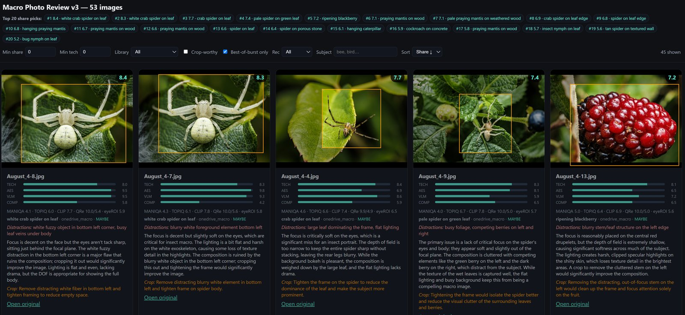

# macro-review

Local AI pipeline for culling and ranking **macro / insect / nature** photos. It scores technical quality, aesthetics, subject-aware sharpness, and share-worthiness, then produces a browsable HTML gallery so you can find the shots worth posting.



Designed for Windows + NVIDIA GPU (tested on RTX 5090). Runs fully offline with [Ollama](https://ollama.com/) for vision critique, or optionally OpenAI.

---

## What it does

```text
index → preview → heuristics → IQA ensemble → VLM critique
      → ROI sharpness → burst dedupe → rank → HTML/CSV → crop export
```

| Stage | Purpose |
|-------|---------|
| **Index** | Walk source folders (JPG/TIFF/CR3/DNG), store manifest in SQLite |
| **Preview** | EXIF-rotated ~1024px JPEG cache (RAW via embedded thumb / rawpy) |
| **Heuristics** | Fast OpenCV Laplacian sharpness + exposure clipping |
| **IQA** | Ensemble of no-reference quality/aesthetic models via `pyiqa` |
| **Analyze** | Macro-specific VLM critique (eye focus, DOF, crop boxes, share rec) |
| **ROI** | Full-res sharpness on subject/eye regions + composition metrics |
| **Dedupe** | pHash + EXIF-time burst groups; pick best-of-burst |
| **Rank** | Percentile-calibrated `share_score` with tech/aes/vlm/comp sub-scores |
| **Report** | Filterable HTML gallery + CSV |
| **Crop export** | Full-res crops for top crop-worthy picks |

All stages are **resumable** — interrupt anytime and re-run the same command; already-scored work is skipped unless you pass `--force`. Scores are written to SQLite after each image, so a mid-run Ctrl+C only loses the image in progress.

---

## Requirements

- Windows 10/11 (Linux should work with path tweaks)
- Python 3.11+ (tested on 3.13)
- NVIDIA GPU + recent driver for CUDA PyTorch and local VLM
- [Ollama](https://ollama.com/) with a **vision** model (default: `qwen3.6:35b`), or an OpenAI API key

### Python packages

```powershell
pip install -r requirements.txt

# CUDA PyTorch (RTX 50-series / CUDA 12.8 example — see setup_gpu.md)
pip install torch torchvision --index-url https://download.pytorch.org/whl/cu128

pip install pyiqa ImageHash
```

Verify GPU:

```powershell
python -c "import torch; print(torch.cuda.is_available(), torch.cuda.get_device_name(0))"
```

---

## Quick start

1. **Desktop GUI** (setup wizard + Library run + settings):

```powershell
pip install -r requirements-gui.txt
python -m gui
```

Install GUI deps on your system/dev Python (PySide6 only). Setup/doctor use that interpreter; **Library → Start** runs `main.py run` with the managed AppData venv (`pipeline_python`). **Results** is an in-app native gallery (thumbnails from the preview cache); `report.html` remains available to open externally.

2. **Settings + managed environment** (CLI path):

```powershell
python main.py settings init
python main.py setup --yes
python main.py doctor --pipeline
```

`setup` creates `%LOCALAPPDATA%\MacroReview\venv`, installs CUDA/CPU torch + deps, ensures Ollama/model, and writes `pipeline_python` into settings. Paths also live in `%LOCALAPPDATA%\MacroReview\settings.json` (override with `MACROREVIEW_SETTINGS`). Env vars still win (`OLLAMA_HOST`, `VISION_MODEL`, `BACKEND`, `MACROREVIEW_DATA_DIR`, …).

3. **Smoke test** a small batch (direct files in that folder only):

```powershell
cd path\to\macro-review
python main.py run --dir "C:\path\to\your\macro\folder" --limit 10
```

4. Open `report.html` in a browser (uses `file://` links to originals).

5. Full library (hours for VLM on ~1.5k images):

```powershell
python main.py run
```

6. **Resume** after an interrupt — re-run the same scoped command **without** `--force` (and ideally without `--limit`):

```powershell
python main.py run --dir "C:\path\to\your\macro\folder"
```

Machine-readable progress for tools/GUI (JSON Lines on stdout):

```powershell
python main.py run --dir "C:\path\to\folder" --progress jsonl
# or: $env:MACROREVIEW_PROGRESS = "jsonl"
```

---

## CLI reference

```text
python main.py <command> [--dir PATH ...] [--recursive] [--progress human|jsonl] [--limit N] [--force]
```

| Command | Description |
|---------|-------------|
| `index` | Scan folders into SQLite |
| `preview` | Build preview JPEGs |
| `heuristics` | Local sharpness / exposure |
| `iqa` | IQA ensemble (TOPIQ, CLIP-IQA+, MANIQA, LAION-Aes, NIMA, Q-ReAlign, …) |
| `analyze` | VLM macro critique (`--backend ollama\|openai`) |
| `roi` | Full-res eye/subject ROI + composition |
| `dedupe` | Burst / near-duplicate grouping |
| `rank` | Recompute `share_score` (no model calls) |
| `report` | Rebuild HTML + CSV |
| `crop-export` | Export suggested crops (`--threshold`, `--limit`) |
| `run` | Chain all stages (resumable) |
| `settings` | `show` / `init` / `set-data-dir` / `add-library` |
| `doctor` | Probe GPU/Python/torch/Ollama (`--pipeline` uses managed venv) |
| `setup` | Create managed venv, install torch/deps, ensure Ollama/model |

### Folder scoping (`--dir`)

| Invocation | What gets processed |
|------------|---------------------|
| `--dir "D:\shoot"` | Files **directly** in that folder only |
| `--dir "D:\shoot" --recursive` | That folder **and** all subfolders |
| *(no `--dir`)* | Default `SOURCE_DIRS` libraries, recursively |

`--dir` is repeatable. The CLI prints `Scoped to (direct files only):` or `Scoped to (recursive):` so you can confirm before a long run.

### Useful patterns

```powershell
# One shoot folder (no subfolders)
python main.py run --dir "C:\Users\you\Pictures\MACRO\Aug 4"

# Include nested folders under that path
python main.py run --dir "C:\Users\you\Pictures\MACRO\Aug 4" --recursive

# Check GPU / deps before a long run
python main.py doctor
python main.py doctor --pipeline
python main.py doctor --json

# First-time / repair managed environment
python main.py setup --dry-run
python main.py setup --yes

# Smoke test: first N images in a folder
python main.py run --dir "\\NAS\Photos\MACRO\shoot" --limit 10

# Resume after Ctrl+C (omit --force / --limit)
python main.py run --dir "\\NAS\Photos\MACRO\shoot"

# Re-blend rankings after editing weights in config.py
python main.py rank --force
python main.py report

# IQA only (GPU, no Ollama needed)
python main.py iqa --dir "D:\macros"

# Force re-analyze with new prompt version
python main.py analyze --force --limit 20
```

**Note:** On `run`, `--limit` also forces reprocessing of heuristics/IQA/analyze/ROI for the selected set (so a limited smoke test stays consistent). For resume, drop `--limit` so completed images are skipped.

---

## Scoring model

### IQA ensemble (`pyiqa`)

Stored per image in `iqa_metrics`:

| Metric | Role |
|--------|------|
| `topiq_nr` | Technical / perceptual quality |
| `clipiqa+` | CLIP-based quality |
| `maniqa` | Modern NR-IQA |
| `laion_aes` | Fast CLIP aesthetic |
| `topiq_iaa` | Aesthetic assessment |
| `nima` | Classic AVA aesthetic |
| `qrealign_quality` / `qrealign_aesthetic` | Q-Align-style VLM judge (`qrealign-lite` by default; set `QREALIGN_VARIANT=qrealign-pro` for the 9B model) |

Models load sequentially and release VRAM between groups so they don’t fight Ollama.

### VLM critique (`macro_v3`)

Qwen (or OpenAI) returns: overall / sharpness / composition, eye focus, DOF, background, lighting, pose, distractions, share recommendation (`skip` | `maybe` | `share` | `portfolio`), crop suggestion, **`subject_box`** and **`eye_box`** (normalized rectangles for ROI).

### ROI sharpness

On the full-resolution original (or RAW decode): Laplacian, Tenengrad, and FFT energy inside the eye/subject boxes vs background — plus rule-of-thirds distance, subject size, edge-cut, and background clutter.

### `share_score` (blend_v2)

Components are **percentile-ranked within your library** (0–10), then blended:

| Sub-score | Default mix |
|-----------|-------------|
| **tech** (35%) | TOPIQ-NR, CLIP-IQA+, MANIQA, Q-ReAlign quality, eye ROI sharpness |
| **aes** (25%) | Q-ReAlign aesthetic, TOPIQ-IAA, LAION-Aes, NIMA |
| **vlm** (25%) | overall, eye_focus, pose |
| **comp** (15%) | VLM composition, thirds, bg separation, clutter |

Edit weights in `config.py` (`TECH_WEIGHTS`, `AES_WEIGHTS`, `VLM_WEIGHTS`, `COMP_WEIGHTS`, `SHARE_WEIGHTS_V2`), then:

```powershell
python main.py rank --force
python main.py report
```

---

## Outputs

| Path | Contents |
|------|----------|
| `cache/review.db` | SQLite state (images, scores, metrics, rankings) |
| `cache/previews/` | Cached preview JPEGs |
| `report.html` | Interactive gallery (share score, sub-score bars, best-of-burst, filters) |
| `results.csv` | Flat export for spreadsheets |
| `suggested_crops/` | Full-res crop JPEGs |
| `logs/` | Analyze error log |

These are gitignored — regenerate anytime with the CLI.

---

## Configuration cheatsheet

User settings file: `%LOCALAPPDATA%\MacroReview\settings.json` (`python main.py settings show`).

| Setting | Default | Notes |
|---------|---------|-------|
| `data_dir` | legacy project path until you change it | Workspace for `cache/`, `report.html`, crops, logs |
| `libraries` | seeded defaults on `settings init` | Default scan roots when `--dir` is omitted |
| `OLLAMA_HOST` / `ollama_host` | `http://localhost:11435` | Env overrides settings; `0.0.0.0` → `localhost` |
| `VISION_MODEL` / `vision_model` | `qwen3.6:35b` | Must support vision |
| `BACKEND` / `backend` | `ollama` | or `openai` + `OPENAI_API_KEY` |
| `IQA_DEVICE` / `iqa_device` | `cuda` | |
| `QREALIGN_VARIANT` / `qrealign_variant` | `qrealign-lite` | or `qrealign-pro` |
| `pipeline_python` | set by `setup` | Managed venv interpreter; `doctor --pipeline` uses this |
| `MACROREVIEW_DATA_DIR` | — | Env override for data_dir |
| `MACROREVIEW_PROGRESS` | `human` | or `jsonl` for machine-readable stdout |
| `PROMPT_VERSION` | `macro_v3` | Code constant; bump to force VLM re-score |
| `CROP_SCORE_THRESHOLD` | `7.0` | Min share/overall for crop export |
| `PHASH_HAMMING_MAX` | `10` | Near-dupe sensitivity |
| `BURST_GAP_SECONDS` | `20` | Max EXIF time gap for bursts |

Blend weights remain in [`config.py`](config.py) (`TECH_WEIGHTS`, `AES_WEIGHTS`, …).

See also [`gui_build_roadmap.md`](gui_build_roadmap.md) for the desktop-app phase plan.

---

## Project layout

```text
main.py              CLI entry
config.py            Constants + settings-backed paths
settings.py          User settings load/save (AppData JSON)
progress.py          Human / JSONL progress reporters
hardware.py          GPU/env probe + doctor recommendations
setup_env.py         Managed venv + pip/Ollama setup orchestrator
db.py                SQLite schema + migrations
indexer.py           Folder scan
previews.py          Preview cache
heuristics.py        OpenCV pre-pass
iqa.py               pyiqa ensemble
vision_backend.py    Ollama / OpenAI VLM
analyze.py           VLM scoring loop
roi_sharpness.py     Full-res ROI + composition
dedupe.py            pHash / burst groups
rank.py              Percentile blend_v2
report.py            HTML + CSV
crop_export.py       Crop writer
image_io.py          Shared full-res / RAW loader
gui_build_roadmap.md Desktop GUI phase plan
gui/                 PySide6 shell (`python -m gui`; Results gallery under gui/results/)
requirements-gui.txt PySide6 for the desktop UI (no WebEngine)
setup_gpu.md         CUDA / CPU / AMD guidance + doctor
```

---

## Tips

- **GUI**: `pip install -r requirements-gui.txt` then `python -m gui` (Setup, Library run, native Results gallery, Settings).
- **Doctor**: Run `python main.py doctor` (current Python) or `doctor --pipeline` (managed venv from `setup`).
- **Setup**: Prefer `python main.py setup --yes` over hand-installing CUDA torch; use `--skip-ollama` / `--skip-model` when those are already fine.
- **Resume**: Re-run the same `run` / stage command; pending work continues. Avoid `--force` and `--limit` when picking up mid-batch.
- **Subfolders**: `--dir` does not descend into nested folders unless you pass `--recursive`. Useful when a shoot folder has side albums (e.g. exports) you don’t want scored.
- **VRAM**: Run `iqa` when large Ollama models are unloaded if you hit OOM. Fast IQA metrics are small; `qrealign-lite` needs several GB.
- **NAS / OneDrive**: Preview + ROI read originals; cloud-only placeholders may fail and are logged/skipped.
- **CR3 + DNG pairs**: Same stem are linked in dedupe groups so you don’t double-count.
- **Calibration**: After reviewing the gallery, tweak blend weights rather than re-running models — `rank --force` is seconds.

---

## License

All rights reserved unless otherwise noted.
