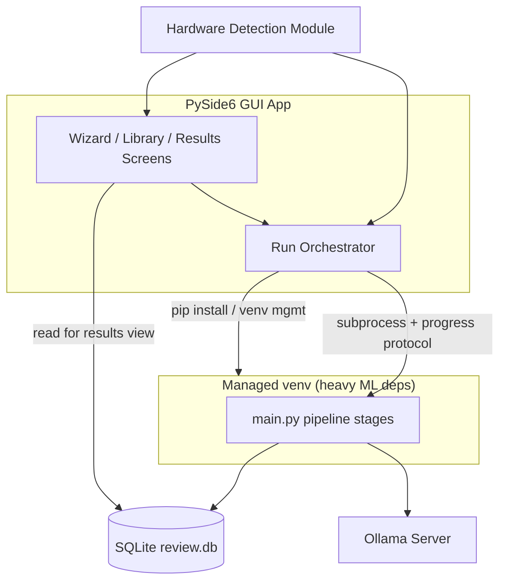

## Decisions locked in (from your answers)

- **UI shell**: PySide6 native desktop app (not Electron/webview). One Python GUI process, packaged later with PyInstaller.
- **Platform/GPU scope for v1**: Windows only; detect and support NVIDIA, AMD, and CPU-only (best-effort per vendor — see risk note below).
- **Setup automation**: In-app wizard that actually runs the install steps (correct `torch` wheel, `pyiqa`, Ollama + model pull) with progress bars. Assumes the user already has a system Python 3.11+; the app does **not** bundle its own Python interpreter.

## Key architecture decision this implies

Heavy ML dependencies (`torch`, `pyiqa`, `opencv`, RAW decoders) should **not** live inside the GUI app's own runtime. Instead:

- The GUI app stays lightweight (PySide6 + orchestration code only) so it packages/installs fast.
- The wizard creates/manages an isolated **venv** in a user data folder (e.g. `%LOCALAPPDATA%\MacroReview\venv`) using the system Python it detects, and `pip install`s the GPU-appropriate packages into it.
- The existing pipeline (`main.py` and friends) keeps running almost unchanged, invoked as a **subprocess** inside that managed venv — this isolates ML crashes/OOM from the GUI, and lets the CLI keep working standalone for power users/automation.
- The GUI and pipeline communicate through: (a) a machine-readable progress stream from the subprocess (replacing bare `tqdm`/`print`), and (b) the existing SQLite `review.db`, which the GUI reads directly to render results.

## Known risk to flag in the doc

PyTorch on Windows officially ships **CUDA (NVIDIA) or CPU** wheels only — there's no official ROCm wheel for Windows. AMD acceleration options are limited to `torch-directml` (partial op coverage, may not support everything `pyiqa`/qrealign need) or CPU fallback. Ollama itself has broader hardware support (works reasonably on AMD/CPU) than raw `pyiqa`/`torch`. The doc will call this out explicitly so "AMD support" scope stays honest per-phase instead of assumed.

## Guiding principles (goes at the top of the doc)

- The CLI remains the source of truth / engine; the GUI is a thin orchestration + presentation layer over it. Nothing in the pipeline should require the GUI to function.
- Settings move from hardcoded Python (`config.py`'s `SOURCE_DIRS`, `PROJECT_ROOT`) to a real user-editable settings file/model.
- Every long-running step stays resumable (matches the resumability work already in place) — the GUI must not regress this.
- Phases are independently shippable and CLI-testable before any UI is built on top of them, so we can validate logic without debugging UI and engine simultaneously.

## Phase breakdown (each planned in full detail when we start it)

1. **Phase 0 — Foundations: config & progress protocol** — **DONE**
   - User settings at `%LOCALAPPDATA%\MacroReview\settings.json` (`settings.py`, `python main.py settings …`)
   - `data_dir` / libraries drive paths; `config.py` keeps product constants
   - JSONL progress via `--progress jsonl` / `MACROREVIEW_PROGRESS` (`progress.py`)
   - CLI behavior unchanged in default human mode; resumability preserved

2. **Phase 1 — Hardware detection module** — **DONE**
   - [`hardware.py`](hardware.py): OS/Python/GPU (`nvidia-smi` + CIM)/torch/Ollama/disk/package probes
   - Recommendations: torch wheel index, `iqa_device`, `qrealign_variant`, vision model tier, readiness checklist
   - CLI: `python main.py doctor` / `doctor --json` / `doctor --strict`
   - AMD: ROCm unavailable on Windows; DirectML marked `experimental_unsupported` (CPU IQA + Ollama VLM)

3. **Phase 2 — Managed environment & install actions** — **DONE**
   - [`setup_env.py`](setup_env.py): managed venv at `%LOCALAPPDATA%\MacroReview\venv`
   - CLI: `python main.py setup [--yes|--dry-run|--skip-ollama|--skip-model|--force-recreate-venv]`
   - Installs torch from doctor recommendations, then filtered `requirements.txt` (+ ImageHash)
   - Ollama installer download/launch if missing; `ollama pull` for recommended vision model
   - Writes `pipeline_python` + recommended knobs to settings; `doctor --pipeline` verifies managed venv

4. **Phase 3 — PySide6 app shell & setup wizard UI** — **DONE**
   - [`gui/`](gui/): sidebar shell (Setup / Library / Results / Settings), photographer-neutral QSS
   - Setup wizard + Settings wired to `doctor --json` / `setup --yes --progress jsonl` via `CliWorker`
   - Library & Results stubs for Phases 4–5; launch with `pip install -r requirements-gui.txt` then `python -m gui`

5. **Phase 4 — Folder picker & run orchestration UI** — **DONE**
   - Library page: browse / drag-drop folder, saved libraries, Start / Continue / Cancel
   - `CliWorker.run_pipeline` invokes managed `pipeline_python` with `run --dir … --progress jsonl`
   - ProgressPanel overall bar driven by `run_start.stages`; resume = Continue without `--force`/`--limit`

6. **Phase 5 — Results / gallery view** — **DONE**
   - Native Qt gallery (`gui/results/`): filter/sort, thumbnail grid, detail pane
   - Reads scored rows via `report.load_scored_rows`; crop-export via managed `pipeline_python`
   - No WebEngine — `report.html` remains available as a secondary open action

7. **Phase 6 — Packaging & distribution**
   PyInstaller build for the GUI app (kept lightweight since ML deps live in the managed venv, not the bundle), installer (Inno Setup/MSI), first-run experience validated on a clean Windows VM with no dev tools, update strategy.

8. **Phase 7 — Polish & expansion hooks**
   Crash-safe logs surfaced in-app, exportable diagnostics bundle for support requests, structure that lets new IQA metrics/backends/models be added without UI changes, multi-library support, and explicit notes on what would be needed for macOS/Linux later (kept out of scope now, but detection module stays OS-isolated so it's not precluded).

## Deliverable for this task

Write `BUILD_PLAN.md` at the repo root containing the principles, architecture diagram, risk notes, and the phase breakdown above (each phase as a checklist-style section with goal, scope, and open decisions — not implementation detail, since that gets planned per-phase later).
